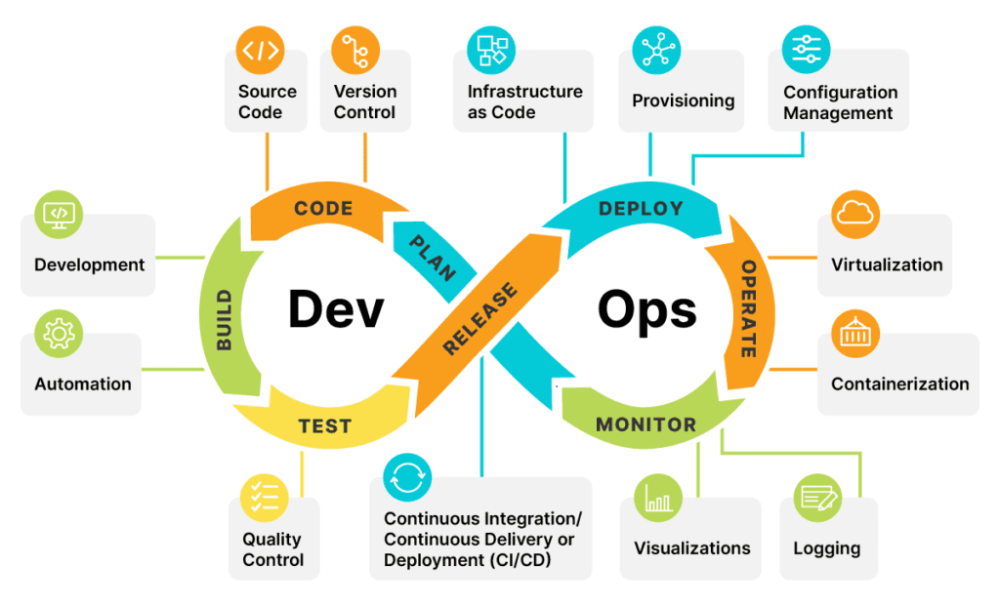
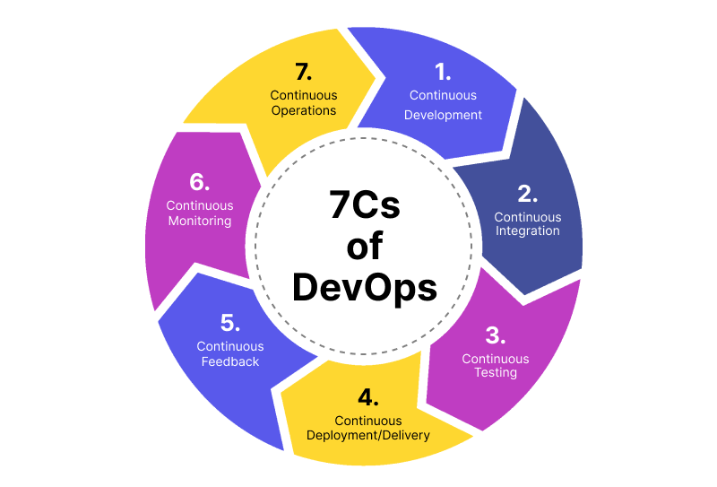
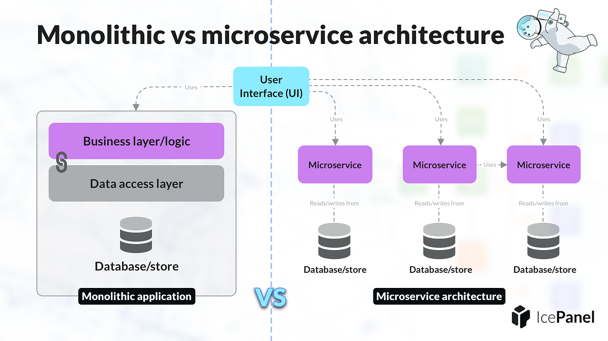
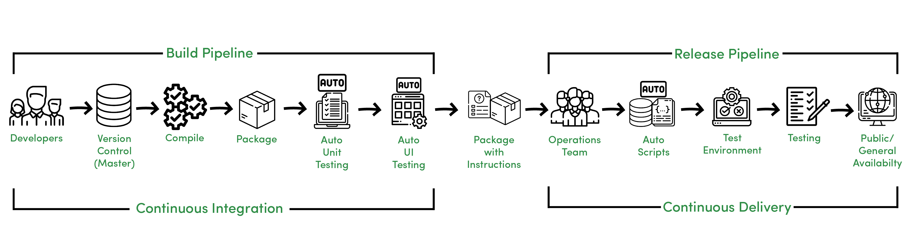

# **INTRODUCTION TO DEVOPS CONCEPTS**

---

## **1. What is DevOps**

DevOps is a **software development methodology** that combines **Development (Dev)** and **Operations (Ops)** to improve **collaboration, automation, and continuous delivery** of software applications.

The main objective of DevOps is to **shorten the software development lifecycle**, increase **deployment frequency**, and deliver **high-quality software reliably**.

DevOps is not a single tool or technology; it is a **culture, set of practices, and automation techniques** that bring development and operations teams together.

### **Key Characteristics of DevOps**

* Collaboration between teams
* Automation of processes
* Continuous integration and deployment
* Faster feedback and monitoring

---

## **2. DevOps Lifecycle**

The DevOps lifecycle represents the **continuous stages involved in software delivery**.

### **Stages of DevOps Lifecycle**

1. **Planning** – Requirement analysis and sprint planning
2. **Coding** – Writing source code using version control
3. **Building** – Compiling and building the application
4. **Testing** – Automated and manual testing
5. **Release** – Preparing application for deployment
6. **Deployment** – Deploying to production servers
7. **Operation** – Maintaining infrastructure and services
8. **Monitoring** – Tracking performance and collecting feedback

➡ The lifecycle is **continuous**, ensuring continuous improvement.

---

## **3. Importance of DevOps**

DevOps plays a crucial role in modern software development by addressing the limitations of traditional development models.

### **Why DevOps is Important**

* Reduces time to market
* Improves collaboration between teams
* Enables faster issue resolution
* Supports frequent software updates
* Enhances system reliability

---

## **4. Benefits of DevOps**

### **Technical Benefits**

* Continuous delivery of software
* Automated testing and deployment
* Reduced deployment failures
* Faster recovery from failures

### **Business Benefits**

* Faster feature delivery
* Improved customer satisfaction
* Cost efficiency
* Better product quality

---

## **5. Collaboration Between Development and Operations**

In traditional models, development and operations teams work **independently**, causing delays and conflicts.

DevOps promotes **shared responsibility**, where both teams collaborate throughout the lifecycle.

### **Key Aspects of Collaboration**

* Common goals and responsibilities
* Continuous communication
* Shared tools and processes
* Automated workflows

This collaboration leads to **faster deployments** and **stable systems**.

---

## **6. Microservices and Containers**

### **Microservices Architecture**

Microservices architecture breaks an application into **small, independent services**, each performing a specific function.

### **Advantages of Microservices**

* Independent deployment
* Scalability
* Fault isolation
* Faster development

---

### **Containers**

Containers are **lightweight virtualization technologies** that package an application with its dependencies.

### **Advantages of Containers**

* Fast startup
* Platform independence
* Efficient resource usage
* Easy deployment

➡ **Docker** is the most commonly used container platform.

---

## **7. Version Control System (VCS)**

A Version Control System is a tool that **tracks changes in source code** and helps multiple developers work on the same project.

### **Functions of VCS**

* Maintains history of changes
* Enables collaboration
* Supports branching and merging
* Prevents code conflicts

### **Types of Version Control**

* Centralized (SVN)
* Distributed (Git)

---

## **8. DevOps Technical Challenges**

Despite its advantages, DevOps faces several challenges.

### **Major Challenges**

* Resistance to cultural change
* Complexity of tools
* Security integration
* Skill gaps
* Infrastructure management

---

## **9. DevOps Tools Used**

DevOps uses various tools to automate and manage the development pipeline.

### **Common DevOps Tools**

* **Git** – Version control
* **Docker** – Containerization
* **Jenkins** – Continuous integration
* **Maven** – Build automation
* **Kubernetes** – Container orchestration
* **Ansible / Puppet** – Configuration management
* **Nagios** – Monitoring

---

## **10. Conclusion**

DevOps is a **modern software development approach** that emphasizes **automation, collaboration, and continuous delivery**. By adopting DevOps practices, organizations can deliver software **faster, more reliably, and with higher quality**.

---

